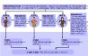

# MBTI-in-Thoughts

<div align="center">
**[Setup Guide](#setup)** |
**[Documentation](#documentation)** |
**[Citations](#citations)** |
**[Framework](high-level-framework-description)**
</div>

<p align="center">
  
</p>

This is the official implementation of [Psychologically Enhanced AI Agents](https://arxiv.org/abs/2509.04343).

MBTI-in-Thoughts is a framework for enhancing the effectiveness of Large Language Model (LLM) agents through psychologically grounded personality conditioning.
Drawing on the Myers–Briggs Type Indicator (MBTI), our method primes agents with distinct personality archetypes via prompt engineering, enabling control over behavior along two foundational axes of human psychology, cognition and affect.
Our framework supports experimenting with structured multi-agent communication protocols.
To ensure trait persistence, we integrate the official 16Personalities test for automated verification.
By bridging psychological theory and LLM behavior design, we establish a foundation for psychologically enhanced AI agents without any fine-tuning.

## Setup

In order to use this framework, you need to have a working installation of Python 3.11.5 or newer.

### Installing MBTI-in-Thoughts

Before running the installation, make sure to activate your Python environment (if any) beforehand.

You can install MBTI-in-Thoughts from source by using the following commands:
```bash
git clone https://github.com/spcl/MBTI-in-Thoughts
cd MBTI-in-Thoughts
pip install .
```

## Documentation

You can find the code to run the MBTI questionaire in [src/MBTITest](src/MBTITest).
The code for the generation and evaluation of short stories using WritingPrompt is in [src/WritingPrompt](src/WritingPrompt).
An example output for these short stories can be found in [examples/mortician.txt](examples/mortician.txt).

We provide two use cases for the collaboration of multiple personality primed agents.
The first one on a number of tasks from BIG-Bench and SOCKET is located at [src/MultiAgent-BenchmarkTasks](src/MultiAgent-BenchmarkTasks).
The second use case tests differently primed agents on a number of different games.
You can find its code in the directory [src/MultiAgent-GameTheory](src/MultiAgent-GameTheory).


## Citations

If you find this repository useful, please consider giving it a star! If you have any questions or feedback, don't hesitate to reach out and open an issue.

When using this in your work, please reference us with the citation provided below:

```bibtex
@misc{besta2025psychologically,
  title = {{Psychologically Enhanced AI Agents}},
  author = {Besta, Maciej and Chandran, Shriram and Gerstenberger, Robert and Lindner, Mathis and Chrapek, Marcin and Martschat, Sebastian Hermann and Ghandi, Taraneh and Niewiadomski, Hubert and Nyczyk, Piotr and M\"{u}ller, J\"{u}rgen and Hoefler, Torsten},
  year = 2025,
  month = Sep,
  doi = {10.48550/arXiv.2509.04343},
  url = {http://arxiv.org/abs/2509.04343},
  eprinttype = {arXiv},
  eprint = {2509.04343}
}
```


## High-Level Framework Description

<p align="center">
  
</p>

We describe the MBTI-in-Thoughts (MiT) framework.
It consists of two core components: (1) individual agent priming, where LLMs are conditioned with psychological profiles via structured prompts and validated using standardized personality assessments; and (2) structured multi-agent communication, where we implement progressively expressive interaction protocols (from isolated voting to decentralized dialogue with self-reflective memory) to study the effects of personality on group reasoning dynamics.


### Priming Individual Agents

MiT conditions an LLM agent to adopt a specified psychological profile by combining prompt-based priming with standardized behavioral evaluation.
The process consists of two key stages: (1) injecting personality priors through a structured prompt; and (2) verifying the agent's behavioral alignment using an external psychometric test.
We now detail these stages.


#### Instilling Psychological Profile

To simulate a desired psychological type, the agent is prompted with a structured instruction that includes both a role-setting context and a behavior-guiding directive.
For each of the 16 MBTI profiles, we construct personality-specific prompts that define the agent's perspective.
We explored three styles of context construction: (i) a minimal prompt with only a short personality tag (e.g., "Respond from an ISFP perspective."), (ii) a general MBTI-oriented context derived from LLM summarization of the foundational MBTI literature that explicitly refers to the MBTI theory, and (iii) a detailed profile-specific context tailored to each MBTI type that however does not explicitly refer to MBTI


#### Verification

To assess whether the primed agent indeed behaves in accordance with the intended psychological profile, we use the official 16Personalities test (a 60-item instrument scored on a 7-point Likert scale).
This test is treated as a black-box evaluation tool: the agent answers the full set of personality assessment items under the influence of the priming prompt, and the resulting responses are submitted to the online backend for scoring.
The prompter asks the question by injecting four specific exemplars aligned with the target type's stance on each axis and enforces <Rating> tags around the final choice, enabling deterministic parsing. The output is a vector of four numerical scores in [0, 100], corresponding to the E/I, S/N, T/F, and J/P axes.


#### Ensuring Robustness

To establish robustness, we repeat this process across model variants and generate empirical confidence intervals around each dichotomy score.
We find that several axes (particularly E/I, T/F, and J/P) exhibit strong and reproducible separability, indicating that LLM agents can be reliably steered toward distinct personality-aligned behaviors via in-context priming alone.


### Multi-Agent Communication

Building on robustly priming individual LLM agents with distinct psychological profiles, MBTI-in-Thoughts also enables structured multi-agent communication and collective reasoning.
Here, we implement three explicit communication protocols, each defining rules for message exchange, memory sharing, and consensus formation.
We now detail them, an illustration can be found in the figure above (the right side).


#### Majority Voting

This protocol captures the isolated reasoning of individual agents.
All agents receive the same task prompt and respond independently, without access to peer outputs.
Each agent is prompted to first generate a brief justification and then provide its answer in a structured format.
This self-reflective generation reduces erratic behavior and improves output consistency.
Once all responses are collected, a majority vote determines the final group decision.


#### Interactive Communication.

The second protocol introduces decentralized communication through a persistent shared memory structure (i.e., a blackboard) that all agents can read from and write to.
One agent is randomly selected to initiate the dialogue and then passes control to another agent of its choosing.
This flexible, peer-directed turn-taking simulates a conversation among equals.
Agents contribute their reasoning by appending it to the blackboard, and work toward a shared solution.
To avoid indefinite dialogues, we embed instruct agents to detect and declare consensus.
Upon reaching agreement, the last agent terminates the conversation.
A designated judge agent then produces the final decision based on the concluding message, minimizing token cost while preserving outcome fidelity.


#### Interactive Communication With Self-Reflection.

The third protocol extends the previous one by equipping each agent with a private scratchpad, i.e., a memory buffer populated before any interaction begins, which enables self-reflection.
After being personality-primed, each agent internally deliberates on the task and records its thoughts in the scratchpad. When later called upon to contribute to the shared blackboard, the agent has access to both the public dialogue and its personal memory.
This design promotes deeper autonomy and helps prevent echoing by grounding contributions in personality-consistent prior reasoning.
The interaction remains decentralized and consensus-driven, with termination and judging handled as before.
